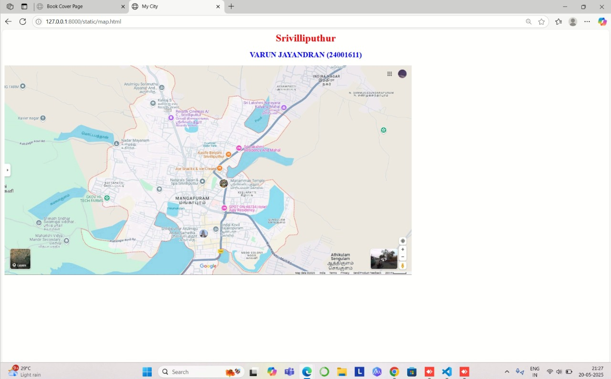
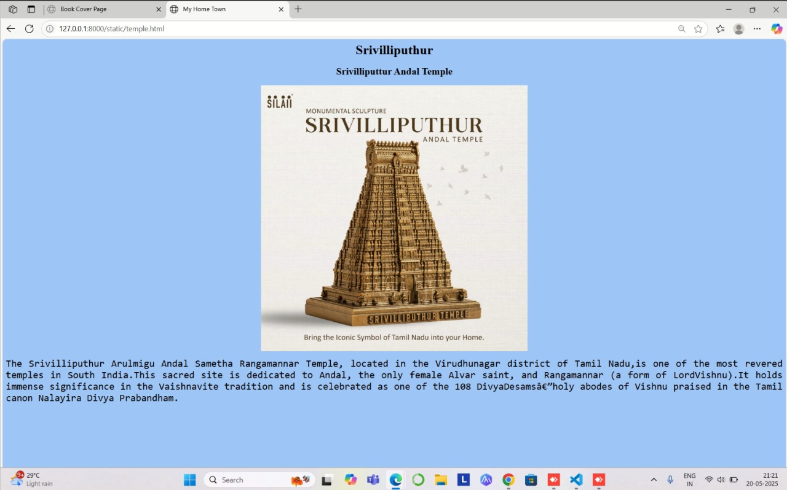
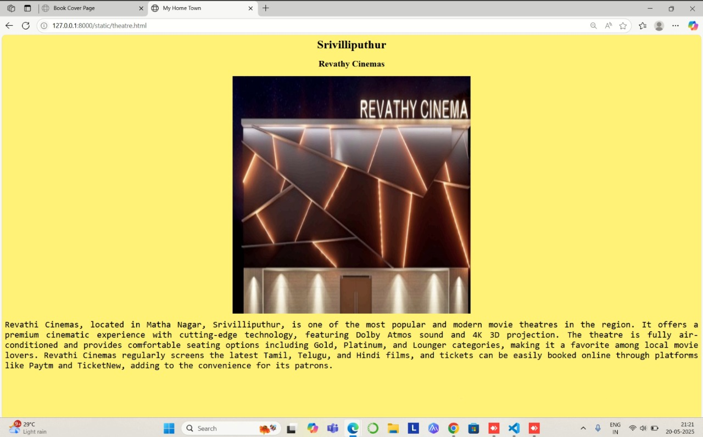
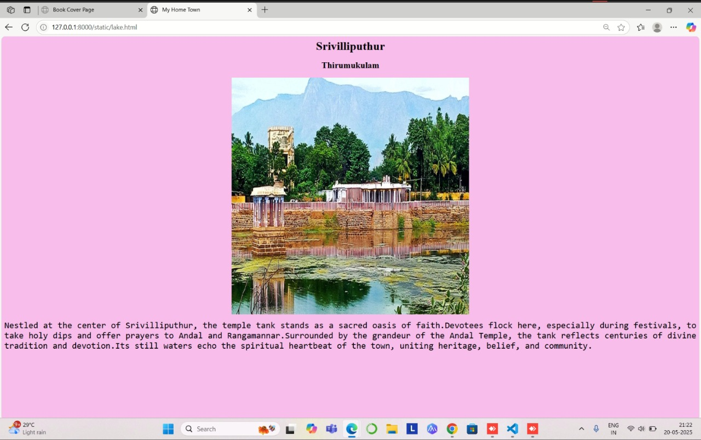
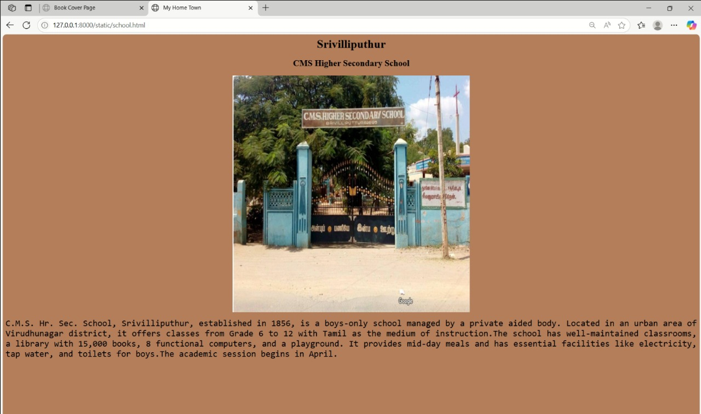

# Ex04 Places Around Me
## Date: 20-05-2025

## AIM
To develop a website to display details about the places around my house.

## DESIGN STEPS

### STEP 1
Create a Django admin interface.

### STEP 2
Download your city map from Google.

### STEP 3
Using ```<map>``` tag name the map.

### STEP 4
Create clickable regions in the image using ```<area>``` tag.

### STEP 5
Write HTML programs for all the regions identified.

### STEP 6
Execute the programs and publish them.

## CODE
**map.html**
```
<html>
    <head>
        <title>My City</title>
    </head>
    <body>
        <h1 align="center">
            <font color="red"><b>Srivilliputhur</b></font>
        </h1>
        <h2 align="center">
            <font color="blue"><b>VARUN JAYANDRAN (24001611)</font>
        </h2>
        <!-- Image Map Generated by http://www.image-map.net/ -->
         
         <map name="image-map">
             <area target="" alt="theatre" title="theatre" href="http://127.0.0.1:8000/static/theatre.html" coords="655,202,512,125" shape="rect">
             <area target="" alt="temple" title="temple" href="http://127.0.0.1:8000/static/temple.html" coords="479,502,636,558" shape="rect">
             <area target="" alt="school" title="school" href="http://127.0.0.1:8000/static/school.html" coords="470,371,511,407" shape="rect">
             <area target="" alt="lake" title="lake" href="http://127.0.0.1:8000/static/lake.html" coords="499,421,564,474" shape="rect">
        </map>
    </body>
</html>

```
**temple.html**
```
<html>
    <head>
        <title>My Home Town</title>
    </head>
    <body style="background-color: #9EC6F3;">
        <h1 align="center">
            <font color="black"><b> Srivilliputhur</b></font>
        </h1>
        <h2 align="center">
            <font color="black"><b>Srivilliputtur Andal Temple</b></font>
        </h2>
        <center></center>
            <p align="justify">
                <font face="Monospace ,Monaco" size="5" style="width: 70%;">
                    The Srivilliputhur Arulmigu Andal Sametha Rangamannar Temple, located in the Virudhunagar district of Tamil Nadu,is one of the most revered temples in South India.This sacred site is dedicated to Andal, the only female Alvar saint, and Rangamannar (a form of LordVishnu).It holds immense significance in the Vaishnavite tradition and is celebrated as one of the 108 DivyaDesams—holy abodes of Vishnu praised in the Tamil canon Nalayira Divya Prabandham.
                </font>
            </p>
    </body>
</html>

```
**theatre.html**
```
<html>
    <head>
        <title>My Home Town</title>
    </head>
    <body style="background-color: #ffef75;">
        <h1 align="center">
            <font color="black"><b> Srivilliputhur </b></font>
        </h1>
        <h2 align="center">
            <font color="black"><b> Revathy Cinemas </b></font>
        </h2>
        <center>
            
        </center>
        <p align="justify">
            <font face="Monospace ,Monaco" size="5" style="width: 70%;">
                Revathi Cinemas, located in Matha Nagar, Srivilliputhur, is one of the most popular and modern movie theatres in the region. It offers a premium cinematic experience with cutting-edge technology, featuring Dolby Atmos sound and 4K 3D projection. The theatre is fully air-conditioned and provides comfortable seating options including Gold, Platinum, and Lounger categories, making it a favorite among local movie lovers. Revathi Cinemas regularly screens the latest Tamil, Telugu, and Hindi films, and tickets can be easily booked online through platforms like Paytm and TicketNew, adding to the convenience for its patrons.
            </font>
        </p>
    </body>
</html>
```

**lake.html**
```
<html>
    <head>
        <title>My Home Town</title>
    </head>
    <body style="background-color: #F8BDEB;">
        <h1 align="center">
            <font color="black"><b>Srivilliputhur</b></font>
        </h1>
        <h2 align="center">
            <font color="black"><b>Thirumukulam</b></font>
        </h2>
        <center>
            
        </center>
        <p align="justify">
            <font face="Monospace ,Monaco" size="5" style="width:fit-content">
                Nestled at the center of Srivilliputhur, the temple tank stands as a sacred oasis of faith.Devotees flock here, especially during festivals, to take holy dips and offer prayers to Andal and Rangamannar.Surrounded by the grandeur of the Andal Temple, the tank reflects centuries of divine tradition and devotion.Its still waters echo the spiritual heartbeat of the town, uniting heritage, belief, and community.
            </font>
        </p>
    </body>
</html>
```
**school.html**
```
 <html>
    <head>
        <title>My Home Town</title>
    </head>
    <body style="background-color: #B17F59;">
        <h1 align="center">
            <font color="black"><b> Srivilliputhur</b></font>
        </h1>
        <h2 align="center">
            <font color="black"><b>CMS Higher Secondary School</b></font>
        </h2>
        <center>
            
        </center>
        <p align="justify">
            <font face="Monospace ,Monaco" size="5" style="width: 70%;">
                C.M.S. Hr. Sec. School, Srivilliputhur, established in 1856, is a boys-only school managed by a private aided body. Located in an urban area of Virudhunagar district, it offers classes from Grade 6 to 12 with Tamil as the medium of instruction.The school has well-maintained classrooms, a library with 15,000 books, 8 functional computers, and a playground. It provides mid-day meals and has essential facilities like electricity, tap water, and toilets for boys.The academic session begins in April.
            </font>
        </p>
    </body>
</html>
```

## OUTPUT

**map.html**

**temple.html**

**thaetre.html**

**lake.html**

**school.html**



## RESULT
The program for implementing image maps using HTML is executed successfully.
